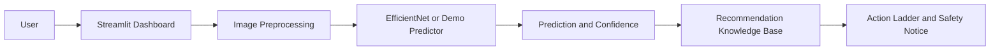

# CropSentinel Project Documentation

## Purpose

CropSentinel turns a pest photograph into a preliminary identification and a cautious action ladder. It is decision support, not an autonomous pesticide prescription system.

## Architecture

## Runtime modes

**Demo mode** runs when no trained checkpoint is present. Its deterministic visual heuristic is labelled in the interface and is suitable for a presentation only.

**Model mode** runs when `models/efficientnet_ip102.pt` and `models/class_names.json` are present. The model receives a 224 x 224 RGB tensor and returns class logits.

## Deployment checklist

1. Verify the IP102 license and record the dataset version.
2. Train and evaluate on a held-out test set.
3. Place the checkpoint and class mapping in `models/`.
4. Review every recommendation against local agricultural guidance.
5. Enforce upload-size limits at the proxy and application layers.
6. Keep user data out of logs and exported history.

## Safety boundary

Chemical guidance must remain generic until reviewed against an authoritative local source. The application must not invent product names, doses, or application schedules. Users should confirm identification and follow local product labels.

## Limitations

The repository does not include IP102 images or a trained checkpoint. Accuracy claims must be added only after training and held-out evaluation.